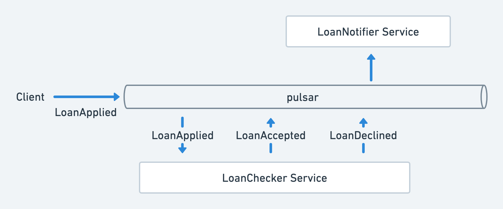

This project illustrates how to work in [Kotlin](https://kotlinlang.org/) with
[Apache Pulsar](https://pulsar.apache.org/).

A live-coding of this project is available on [YouTube](https://www.youtube.com/user/JetBrainsTV).

Another resource on coding for pulsar with Kotlin is also available on 
[medium](https://gillesbarbier.medium.com/using-apache-pulsar-with-kotlin-3b0ab398cf52).

This project illustrates:
- how to serialize messages and send them to Pulsar (with or without schema)
- how to build a service consuming those messages
- how to organize a topic to receive messages of multiple types
- and more...

